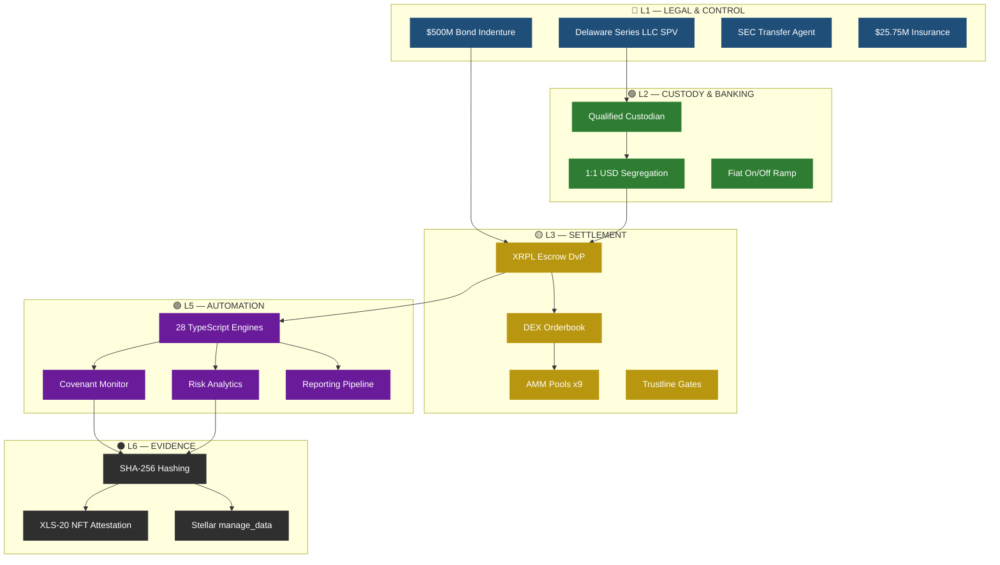
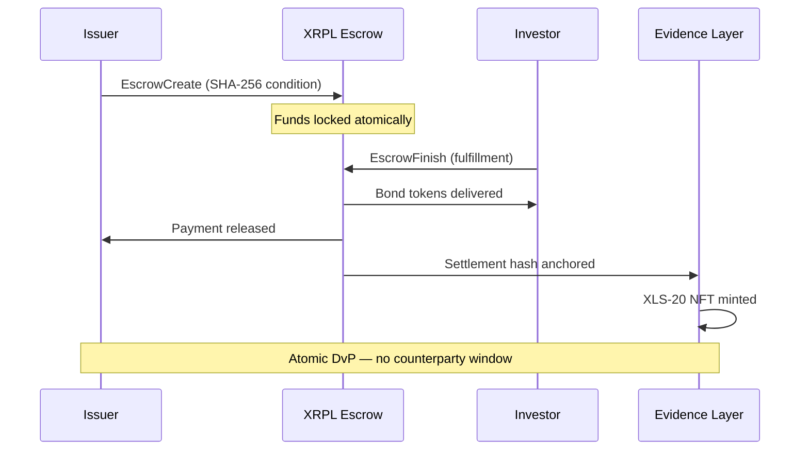
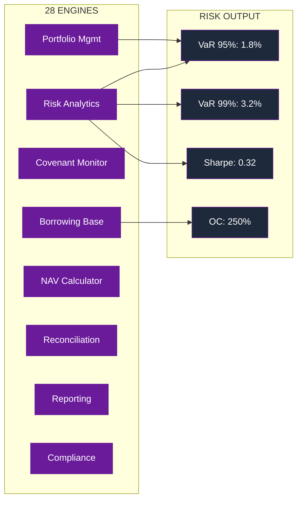
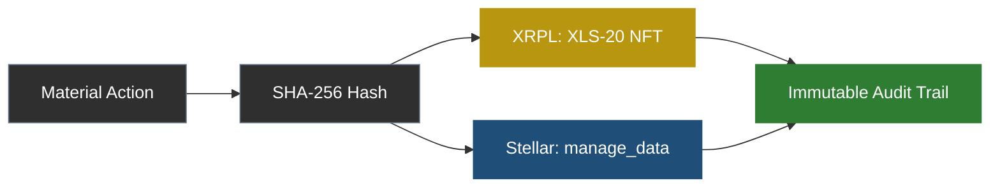
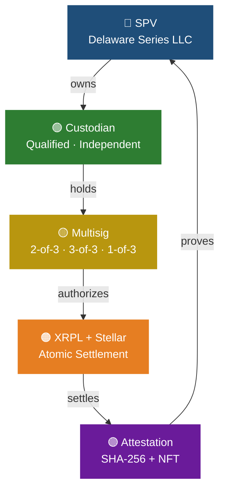
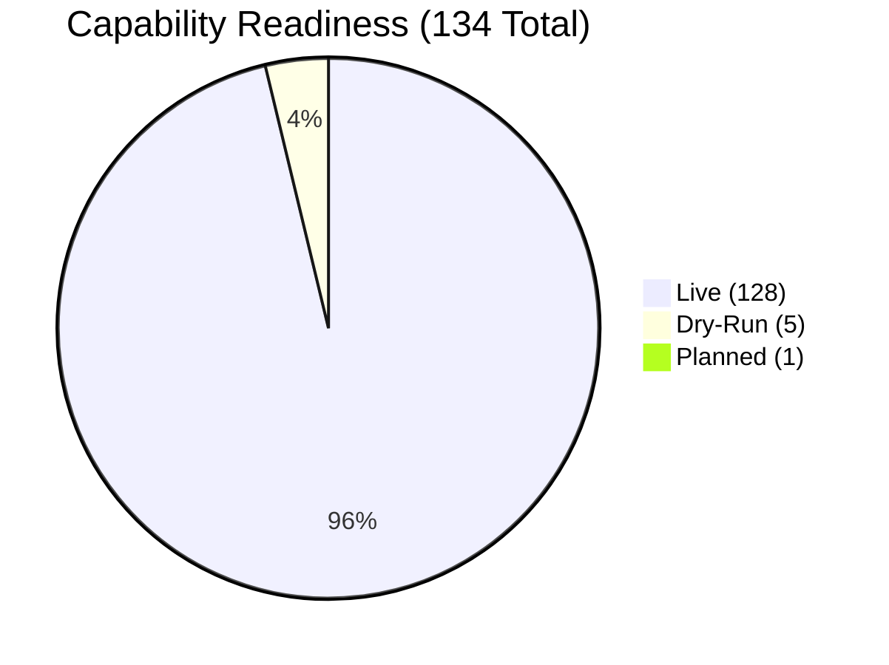

<h1 align="center">
  <br>
  
  <br>
  OPTKAS
  <br>
</h1>

<h4 align="center">Institutional-Grade Settlement & Control Infrastructure</h4>

<p align="center">
  <a href="#-system-status"></a>
  <a href="#-key-metrics"></a>
  <a href="#-architecture-layers"></a>
  <a href="#-capability-status"></a>
  <a href="https://fthtrading.github.io/optkas-manual/institutional.html"></a>
  <a href="#-settlement--evidence"></a>
  <a href="LICENSE"></a>
</p>

<p align="center">
  <a href="https://fthtrading.github.io/optkas-manual/">🌐 Live Manual</a> •
  <a href="https://fthtrading.github.io/optkas-manual/institutional.html">📊 Institutional Overview</a> •
  <a href="docs/00-capability-index.md">📋 Capability Index</a> •
  <a href="docs/13-institutional-readiness.md">✅ Readiness Scorecard</a>
</p>

---

> **Legally Anchored. Multisig Governed. XRPL-Settled.**
>
> A dual-ledger system that internalizes clearing, transfer agency, custodial escrow, and audit verification
> into a single control infrastructure — operating under a Delaware Series LLC with independent custody,
> 2-of-3 multisig governance, and dual-chain evidence anchoring.

---

## 📑 Table of Contents

> Each layer is color-coded throughout the entire system — docs, web manual, diagrams, and CSS.

| | Layer | Section | Capabilities | Doc |
|---|---|---|---|---|
| 🔵 | **L1 — Legal & Control** | [SPV · Indenture · Transfer Agent · Insurance](#-l1--legal--control) |  | [docs/02](docs/02-legal-control-layer.md) |
| 🟢 | **L2 — Custody & Banking** | [1:1 USD · Stablecoin · Fiat Rails](#-l2--custody--banking) |  | [docs/03](docs/03-custody-banking.md) |
| 🟡 | **L3 — Settlement (XRPL)** | [Escrow · DvP · DEX · AMM · Multisig](#-l3--settlement-xrpl) |  | [docs/04](docs/04-xrpl-settlement-layer.md) |
| 🟠 | **L4 — Asset Issuance** | [6 XRPL IOUs · 1 Stellar Regulated Asset](#-l4--asset-issuance) |  | [docs/05](docs/05-asset-issuance.md) |
| 🟣 | **L5 — Automation & Risk** | [28 Engines · 8 Domains · VaR · Stress](#-l5--automation--risk) |  | [docs/06](docs/06-automation-engines.md) |
| ⚫ | **L6 — Ledger Evidence** | [SHA-256 · NFT Attestation · Dual-Chain](#-l6--ledger-evidence) |  | [docs/07](docs/07-ledger-evidence.md) |
| 🔴 | **L7 — Boundaries** | [8 "Not-A" Regulatory Boundaries](#-l7--boundaries--scope) |  | [docs/11](docs/11-boundaries-regulatory-scope.md) |
| | **Cross-Layer** | [Operations · Revenue · Workflows](#-cross-layer) |  | [docs/09](docs/09-operations-workflows.md) |

**Total: 134 capabilities · 128 live · 5 dry-run · 1 planned**

| Additional Sections | Link |
|---|---|
| 📊 Key Metrics & Program Data | [Jump ↓](#-key-metrics) |
| 🏗️ System Architecture Flowchart | [Jump ↓](#-system-architecture) |
| 🔁 Settlement Flow | [Jump ↓](#-settlement--evidence) |
| 🔐 Governance & Control Chain | [Jump ↓](#-governance--control-chain) |
| ⚠️ Risk Exposure & Known Gaps | [Jump ↓](#️-risk-exposure--known-gaps) |
| 📁 Repository Structure | [Jump ↓](#-repository-structure) |
| 🚀 Deployment & Build | [Jump ↓](#-deployment--build) |

---

## 📊 System Status

| Component | Status | Detail |
|---|---|---|
| **Platform Infrastructure** |  | All 7 layers active on mainnet |
| **Capital Program** |  | $10M first tranche deployed |
| **Settlement (XRPL)** |  | 6 XRPL mainnet accounts |
| **Settlement (Stellar)** |  | 3 Stellar mainnet accounts |
| **Multisig Governance** |  | 2-of-3 SignerListSet active |
| **AMM Liquidity** |  | 6 XRPL + 3 Stellar |
| **Automation Engines** |  | 8 domains covered |
| **Evidence Anchoring** |  | XRPL NFT + Stellar manage_data |
| **External Audit** |  | SOC 2 Type I scoped — target Q3 2026 |

---

## 📈 Key Metrics

<table>
  <tr>
    <td align="center"><strong>$500M</strong><br><sub>MTN Program</sub></td>
    <td align="center"><strong>$10M</strong><br><sub>First Tranche</sub></td>
    <td align="center"><strong>$4.11M</strong><br><sub>Current NAV</sub></td>
    <td align="center"><strong>250%</strong><br><sub>Overcollateral</sub></td>
  </tr>
  <tr>
    <td align="center"><strong>$25.75M</strong><br><sub>Insurance</sub></td>
    <td align="center"><strong>9</strong><br><sub>Mainnet Accounts</sub></td>
    <td align="center"><strong>28</strong><br><sub>Engines</sub></td>
    <td align="center"><strong>97.4%</strong><br><sub>Test Pass Rate</sub></td>
  </tr>
</table>

---

## 🏗️ System Architecture

> Law governs custody. Custody funds engines. Engines create evidence. Evidence settles on-chain.



---

## 🔵 L1 — Legal & Control

> **Color: Blue `#1f4e79`** · Authority & enforceability

| ID | Capability | Mechanism | Status |
|---|---|---|---|
| L1.001 | Structure secured bond program | Delaware Series LLC SPV | ✅ Live |
| L1.002 | Issue $500M Medium-Term Notes | Bond indenture — 5% coupon, 2030 maturity | ✅ Live |
| L1.003 | Execute $10M first tranche | 50 secured notes | ✅ Live |
| L1.004 | Perfect security interest | UCC lien filings on collateral | ✅ Live |
| L1.005 | Registered transfer agent | Securities Transfer Corporation | ✅ Live |
| L1.006 | Enforce bondholder rights | Bond indenture covenants | ✅ Live |
| L1.007 | Insurance coverage | $25.75M blanket policy | ✅ Live |
| L1.008 | SPV governance | Operating agreement + board resolutions | ✅ Live |
| L1.009 | Participation agreements | Lender-level legal onboarding | ✅ Live |
| L1.010 | Off-chain enforcement | Jurisdictional law provisions | ✅ Live |

---

## 🟢 L2 — Custody & Banking

> **Color: Green `#2e7d32`** · Asset protection

| ID | Capability | Mechanism | Status |
|---|---|---|---|
| L2.001 | 1:1 USD custody | Qualified custodian, segregated accounts | ✅ Live |
| L2.002 | Stablecoin trustlines | XRPL + Stellar USD anchors | ✅ Live |
| L2.003 | Fiat on-ramp | Bank wire → stablecoin conversion | ✅ Live |
| L2.004 | Fiat off-ramp | Stablecoin → bank wire redemption | ✅ Live |
| L2.005 | Daily reconciliation | Automated custody balance verification | ✅ Live |
| L2.006 | Investor segregation | Per-investor account isolation | ✅ Live |
| L2.007 | Custodial reporting | Monthly custody statements | ✅ Live |
| L2.008 | Cold storage protocol | Multi-layer key management | ✅ Live |
| L2.009 | Insurance verification | Coverage adequacy monitoring | ✅ Live |
| L2.010 | Custody audit trail | Immutable custody event log | ✅ Live |

---

## 🟡 L3 — Settlement (XRPL)

> **Color: Gold `#c9a227`** · Counterparty elimination · **42 capabilities (41 live, 1 planned)**

**Full capability register:** [docs/04-xrpl-settlement-layer.md](docs/04-xrpl-settlement-layer.md)



---

## 🟠 L4 — Asset Issuance

> **Color: Orange `#e67e22`** · Instrument definition

| Token | Description | Freeze | Clawback | Chain |
|---|---|---|---|---|
| OPTKAS | Primary bond claim receipt | Yes | No | XRPL |
| SOVBND | Sovereign bond claim tracker | Yes | No | XRPL |
| IMPERIA | Asset class claim | Yes | No | XRPL |
| GEMVLT | Vault participation | Yes | No | XRPL |
| TERRAVL | Real estate claim | Yes | No | XRPL |
| PETRO | Energy asset claim | Yes | No | XRPL |
| OPTKAS-R | Regulated asset | Yes | Yes | Stellar |

---

## 🟣 L5 — Automation & Risk

> **Color: Purple `#6a1b9a`** · Operational scaling · **48 capabilities (44 live, 4 dry-run)**

**Full engine register:** [docs/06-automation-engines.md](docs/06-automation-engines.md)



### Stress Scenarios

| Scenario | Market Shock | Credit Spread | Severity |
|---|---|---|---|
| Base Case | 0% | +0 bps | 🟩 Normal |
| Rate Rise (+200 bps) | -5% | +50 bps | 🟨 Moderate |
| Credit Event | -15% | +200 bps | 🟧 Elevated |
| 2008-Level Shock | -40% | +600 bps | 🔴 Severe |
| Issuer Default | -100% | +1000 bps | 🔴 Critical |

---

## ⚫ L6 — Ledger Evidence

> **Color: Graphite `#2f2f2f`** · Immutable proof



Every material action produces a dual-chain evidence anchor: SHA-256 document hash → XLS-20 NFT on XRPL + `manage_data` entry on Stellar. Neither chain can be edited after the fact.

---

## 🔴 L7 — Boundaries & Scope

> **Color: Red `#b71c1c`** · Regulatory containment

| Boundary | Enforcement |
|---|---|
| ❌ Not a Bank | No deposits, no lending to public |
| ❌ Not a Broker-Dealer | No securities recommendations, no customer orders |
| ❌ Not a Custodian | Independent qualified custodian holds assets |
| ❌ Not an Exchange | No multilateral matching, no public orderbook |
| ❌ Not a Money Transmitter | Bilateral settlement only, no third-party transmission |
| ❌ Not a Fund | No pooled capital — SPV issues bonds backed by specific collateral |
| ❌ Not a Clearinghouse | No multilateral netting — DvP is bilateral and atomic |
| ❌ Not the Legal Owner | Tokens mirror legal agreements — law governs ownership |

---

## 🔗 Cross-Layer

> **Color: Cyan `#06b6d4`** · Integration · **14 capabilities (13 live, 1 dry-run)**

Operations, revenue model, and cross-layer workflows.  
See: [docs/09](docs/09-operations-workflows.md) · [docs/10](docs/10-revenue-model.md) · [docs/12](docs/12-credit-committee-narrative.md)

---

## 🔐 Governance & Control Chain



> Each layer constrains the layer above. No single entity controls more than one layer.

| Governance Tier | Signers Required | Use Case |
|---|---|---|
| Standard Operations | 2-of-3 | Settlements, distributions, routine txns |
| Configuration Changes | 3-of-3 | Parameter updates, signer rotation |
| Emergency Freeze | 1-of-3 | GlobalFreeze halt — any signer |

---

## ⚠️ Risk Exposure & Known Gaps

> Institutions trust systems that disclose weakness.

| Exposure | Current State | Gap | Mitigation | Severity |
|---|---|---|---|---|
| Liquidity depth | 9 AMM pools, DEX | No institutional market maker | Designated MM engagement planned | 🟧 Moderate |
| Regulatory classification | DE Series LLC, SEC transfer agent | No SEC/FINRA no-action letter | Reg D 506(c) filing in preparation | 🟧 Moderate |
| Custody concentration | 2-of-3 multisig | No independent institutional signer | Onboarding trustee co-signer | 🟨 Elevated |
| External audit | Internal self-assessment | No SOC 2 or financial audit | SOC 2 Type I — target Q3 2026 | 🟧 Moderate |
| Track record | 128 capabilities live | No full market cycle | Controlled first-tranche deployment | 🟨 Elevated |

---

## 🎯 Capability Status



| Status | Count | Percentage |
|---|---|---|
| ✅ Live on Mainnet | 128 | 95.5% |
| 🟡 Dry-Run (Testing) | 5 | 3.7% |
| ⏳ Planned | 1 | 0.7% |

**Dry-Run Items:**
- Regulatory reporting engine
- Statement generation engine
- Audit report generator
- Key rotation automation
- Backup recovery workflow

**Planned:**
- XRPL `DisableMaster` flag activation

---

## 📁 Repository Structure

```
optkas-manual/
├── 📋 README.md                    ← You are here
├── 📜 LICENSE                      ← MIT
├── 📦 package.json                 ← v1.4.0
│
├── 📂 docs/                        ← 14 structured chapters
│   ├── 00-capability-index.md      ← Full capability matrix (auditor-grade)
│   ├── 01-executive-overview.md    ← Platform positioning
│   ├── 02-legal-control-layer.md   ← 🔵 L1
│   ├── 03-custody-banking.md       ← 🟢 L2
│   ├── 04-xrpl-settlement-layer.md ← 🟡 L3
│   ├── 05-asset-issuance.md        ← 🟠 L4
│   ├── 06-automation-engines.md    ← 🟣 L5
│   ├── 07-ledger-evidence.md       ← ⚫ L6
│   ├── 08-risk-analytics.md        ← Risk models + VaR
│   ├── 09-operations-workflows.md  ← Cross-layer ops
│   ├── 10-revenue-model.md         ← Revenue lanes
│   ├── 11-boundaries-regulatory.md ← 🔴 L7
│   ├── 12-credit-committee.md      ← IC narrative
│   └── 13-institutional-readiness.md ← Readiness scorecard
│
├── 📂 public/                      ← GitHub Pages
│   ├── index.html                  ← Interactive web manual
│   ├── institutional.html          ← Board-room one-pager
│   ├── institutional.css           ← Institutional styles
│   ├── styles.css                  ← Main theme
│   ├── app.js                      ← Navigation + training mode
│   ├── search.js                   ← Global search engine
│   └── audio-controls.js           ← TTS + MP3 narration
│
├── 📂 assets/
│   ├── logo.svg
│   └── diagrams/
│       ├── system-flow.svg         ← Full system data flow
│       ├── settlement-dvp.svg      ← DvP settlement sequence
│       ├── governance-multisig.svg ← Multisig tiers
│       ├── control-map.svg         ← 5-node control chain
│       ├── risk-curve.svg          ← VaR distribution
│       ├── risk-pyramid.svg        ← Risk hierarchy
│       ├── capital-stack.svg       ← Capital structure
│       └── token-taxonomy.svg      ← Token classification
│
├── 📂 audio/                       ← MP3 narration files
├── 📂 releases/                    ← PDF exports
└── 📂 scripts/                     ← Build tools
    ├── build-search-index.js
    ├── build-pdf.js                ← Puppeteer PDF generator
    ├── generate-audio.js
    └── version-bump.js
```

---

## 🚀 Deployment & Build

### GitHub Pages

```bash
# Settings → Pages → Branch: main → Folder: /public → Save
# Live at: https://fthtrading.github.io/optkas-manual/
```

### Build Commands

```bash
npm run build:search    # Rebuild search index
npm run build:pdf       # Generate PDF (requires Puppeteer)
npm run build:audio     # Generate audio files
npm run version:bump    # Bump version across all files
```

### Audio Training

Each section supports two modes:
1. **TTS** — Web Speech API, click 🎧 in any section
2. **MP3** — Upload pre-recorded files to `/audio/`

---

## 📜 Version History

| Version | Date | Changes |
|---|---|---|
| `v1.4.0` | Feb 2026 | SR-engineered README with Mermaid diagrams, color-coded TOC, status dashboard |
| `v1.3.1` | Feb 2026 | Full repo language alignment: sovereign → institutional, Wyoming → Delaware |
| `v1.3.0` | Feb 2026 | Perception hardening: control narrative, exposure disclosure, IC brief |
| `v1.2.0` | Feb 2026 | Institutional snapshot page + readiness scorecard badge |
| `v1.1.0` | Feb 2026 | 12-point SR-enhancement: diagrams, risk heat map, training mode, PDF gen |
| `v1.0.0` | Feb 2026 | Initial platform manual — 27 files, 14 docs, full web manual |

---

## 🤝 Who This Manual Is For

| Audience | Use Case |
|---|---|
| **Credit committees** | Pre-allocation due diligence |
| **Risk officers** | Architecture review, VaR validation, stress scenarios |
| **Legal & compliance** | Boundary analysis, regulatory scope, "not-a" framework |
| **Technical auditors** | Capability verification, proof mechanics, evidence chain |
| **Internal team** | Full operational training and reference |
| **Institutional partners** | Control infrastructure assessment |

---

<p align="center">
  <sub>OPTKAS Settlement & Control Infrastructure · FTH Trading LLC · Delaware Series LLC</sub><br>
  <sub>CONFIDENTIAL — For Authorized Recipients Only</sub>
</p>
