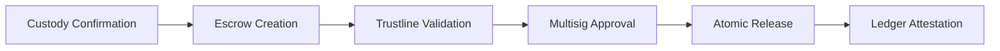
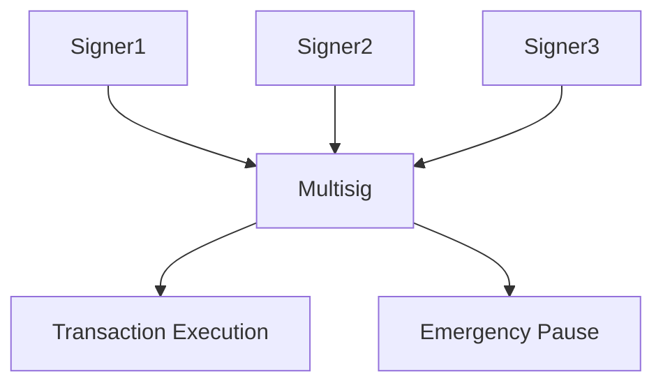

# 04 — XRPL Settlement Layer (L5)

> **Key Principle:** Atomic settlement eliminates counterparty risk. Funds do not move early. Funds do not move unless all conditions are met.

## Layer Summary

| Attribute | Value |
|-----------|-------|
| Layer | L5 — Primary Settlement |
| Capabilities | 42 |
| Status | 41 Live · 1 Planned |

This is the mechanical heart of the platform — the largest capability block and the core competitive advantage.

---

## Settlement Flow (DvP)



## Governance Control



---

## Issuer Account

The Issuer account is the mint authority for all XRPL IOUs. Key configuration:

- **DefaultRipple = ON** — enables token routing through the issuer
- **6 IOUs issued:** OPTKAS, SOVBND, IMPERIA, GEMVLT, TERRAVL, PETRO
- All tokens are controlled via trustline authorization
- Master key disable is planned (post-multisig hardening)

## Treasury Account

Operational balance custody with:

- RequireDestTag = ON
- 4 stablecoin trustlines (Bitstamp, GateHub, Tether, Circle)
- Multisig-controlled

## Escrow Mechanics

XRPL supports two native escrow types — no smart contracts required:

### Time-Based Escrow
```
EscrowCreate → FinishAfter (release time) → CancelAfter (expiry)
```
- Funds locked until a specific time
- Auto-cancels if not finished within the cancel window
- Used for scheduled settlements

### Crypto-Conditional Escrow
```
EscrowCreate → Condition (SHA-256 hash) → Fulfillment (preimage)
```
- Funds locked until a cryptographic condition is met
- Requires the holder of the preimage to release
- Used for DvP (Delivery-vs-Payment)

### DvP (Atomic Delivery-vs-Payment)

The DvP pattern uses dual escrows:

1. **Seller** creates escrow locking claim tokens with a crypto-condition
2. **Buyer** creates escrow locking payment with the same condition
3. **Either party** reveals the fulfillment → both escrows release atomically
4. If conditions are not met within the time window → both auto-cancel

**Result:** Zero trust gap. No clearing agent dependency.

## Trustline Enforcement

Every holder must explicitly opt-in via a TrustSet transaction before receiving any OPTKAS IOU. This means:

- No accidental token distribution
- Issuer controls who can hold tokens
- Compliance is enforced at the ledger level
- 0.2 XRP reserve required per trustline

## Multi-Signature Configuration

| Threshold | Requirement | Use Case |
|-----------|-------------|----------|
| 2-of-3 | Standard transactions | Payments, escrow creation, token minting |
| 3-of-3 | Configuration changes | Account settings, signer rotation |
| 1-of-3 | Emergency operations | Freeze, kill switch |

**Signers:** Unykorn, OPTKAS team member, external trustee

## AMM Pools (XLS-30)

6 XRPL AMM pools provide continuous liquidity:

| Pool | Status |
|------|--------|
| OPTKAS / XRP | Live |
| SOVBND / XRP | Live |
| IMPERIA / XRP | Live |
| GEMVLT / XRP | Live |
| TERRAVL / XRP | Live |
| PETRO / XRP | Live |

**AMM features:**
- Constant liquidity — no orderbook dependency
- Algorithmic pricing curves
- Passive fee earning for LPs
- Arbitrage-corrected pricing
- No counterparty required for swaps

## DEX (Native Orderbook)

XRPL's built-in DEX allows:

- OfferCreate — place limit orders
- OfferCancel — remove orders
- Pathfinding — route payments across currency pairs
- Multi-hop conversions — automatic routing via DEX
- Orderbook depth monitoring

## Circuit Breakers

| Control | Threshold | Action |
|---------|-----------|--------|
| Circuit Breaker | 5% loss | Halt new trading activity |
| Kill Switch | 10% loss | Terminate all open positions |

Both can be triggered by any 1-of-3 signer.

---

## XRPL Settlement Capabilities

| ID | Capability | Mechanism | Status |
|----|-----------|-----------|--------|
| L5.XRP.001 | Issue custom IOUs (6 tokens) | Issuer account Payment transactions | Live |
| L5.XRP.002 | Enforce trustline opt-in | XRPL trustline requirement | Live |
| L5.XRP.003 | Lock funds in time-based escrow | EscrowCreate with FinishAfter | Live |
| L5.XRP.004 | Lock funds in crypto-condition escrow | EscrowCreate with Condition | Live |
| L5.XRP.005 | Release escrow on condition fulfillment | EscrowFinish with Fulfillment | Live |
| L5.XRP.006 | Cancel expired escrow | EscrowCancel after CancelAfter | Live |
| L5.XRP.007 | Execute DvP (atomic swap) | Dual escrow release | Live |
| L5.XRP.008 | Freeze individual trustlines | TrustSet with Freeze flag | Live |
| L5.XRP.009 | Execute global freeze | AccountSet with GlobalFreeze | Live |
| L5.XRP.010 | Place limit orders on native DEX | OfferCreate transactions | Live |
| L5.XRP.011 | Cancel DEX orders | OfferCancel transactions | Live |
| L5.XRP.012 | Route payments across currency pairs | XRPL pathfinding | Live |
| L5.XRP.013 | Execute multi-hop conversions | Auto-routing via DEX | Live |
| L5.XRP.014 | Monitor orderbook depth | Orderbook subscription | Live |
| L5.XRP.015 | Enforce RequireDestTag | AccountSet flag | Live |
| L5.XRP.016 | Enforce DefaultRipple for token routing | AccountSet flag on issuer | Live |
| L5.XRP.017 | Disable master key (post-multisig) | AccountSet DisableMaster | Planned |
| L5.XRP.018 | Mint XLS-20 NFTs | NFTokenMint transactions | Live |
| L5.XRP.019 | Enforce 0.2 XRP reserve per trustline | Native reserve requirement | Live |

## AMM Capabilities

| ID | Capability | Mechanism | Status |
|----|-----------|-----------|--------|
| L5.AMM.001 | Create AMM liquidity pools | AMMCreate transactions | Live |
| L5.AMM.002 | Add liquidity to pools | AMMDeposit transactions | Live |
| L5.AMM.003 | Remove liquidity from pools | AMMWithdraw transactions | Live |
| L5.AMM.004 | Execute token swaps via AMM | Payment through AMM path | Live |
| L5.AMM.005 | Earn passive trading fees | AMM fee distribution | Live |
| L5.AMM.006 | Monitor pool depth and pricing | AMM info queries | Live |
| L5.AMM.007 | Operate 6 XRPL pools | OPTKAS/XRP + 5 others | Live |
| L5.AMM.008 | Provide constant liquidity | Algorithmic pricing curve | Live |
| L5.AMM.009 | Enable arbitrage correction | Cross-pool price alignment | Live |

## Multi-Signature Governance Capabilities

| ID | Capability | Mechanism | Status |
|----|-----------|-----------|--------|
| L5.MSG.001 | Enforce 2-of-3 multisig on transactions | SignerListSet | Live |
| L5.MSG.002 | Require 3-of-3 for config changes | Weight-based signing | Live |
| L5.MSG.003 | Allow 1-of-3 emergency freeze | Emergency signer weight | Live |
| L5.MSG.004 | Support signer rotation | SignerListSet update | Live |
| L5.MSG.005 | Protect against unilateral control | Multi-party approval | Live |

## Stellar Settlement Capabilities

| ID | Capability | Mechanism | Status |
|----|-----------|-----------|--------|
| L5.STL.001 | Issue regulated OPTKAS-USD | Stellar asset + AUTH_REQUIRED | Live |
| L5.STL.002 | Enforce authorization for holders | AUTH_REQUIRED flag | Live |
| L5.STL.003 | Revoke holder authorization | AUTH_REVOCABLE flag | Live |
| L5.STL.004 | Clawback tokens if required | CLAIMABLE_BALANCES flag | Live |
| L5.STL.005 | Operate 3 Stellar AMM pools | OPTKAS-USD/XLM + 2 others | Live |
| L5.STL.006 | Process fiat on/off-ramp via SEP-24 | Anchor integration | Live |
| L5.STL.007 | Enforce 0.5 XLM reserve per trustline | Native reserve requirement | Live |
| L5.STL.008 | Anchor data hashes via manage_data | Stellar manage_data operation | Live |
| L5.STL.009 | Execute SEP-10 authentication | Web auth standard | Live |
